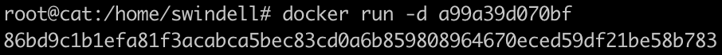
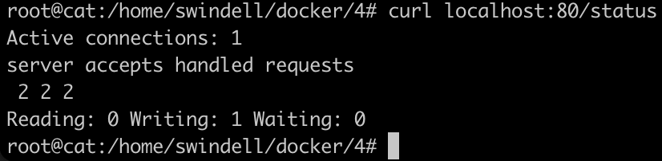
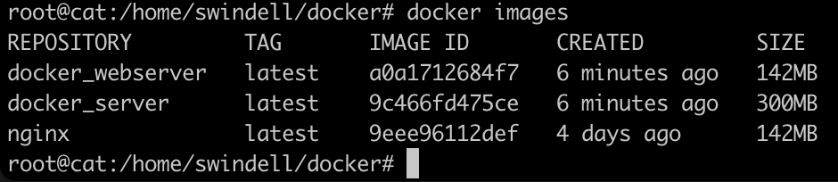

# Simple Docker

## Part 1. Готовый докер
##### 1.1. Возьмем официальный докер образ с **nginx** и выкачаем его при помощи `sudo docker pull nginx`.
Перед этим установим пакет командой `sudo apt install docker.io` \
    

##### 1.2. Проверим наличие докер образа через `docker images` 

##### 1.3. Запускаем докер образ через `docker run -d [image_id|repository]`
В нашем случае командой `docker run -d a99a39d070bf` \
    

##### 1.4. Проверим, что образ запустился через `docker ps`

##### 1.5. Посмотрим информацию о контейнере через `docker inspect [container_id|container_name]`
В нашем случае командой `docker inspect 86bd9c1b1efa` \
    
Далее следует остальной достаточно громоздкий вывод

##### 1.6. По выводу команды определим размер контейнера, список замапленных портов и ip контейнера
Размер контейнера \
     \
Список замапленных портов \
     \
Ip контейнера \
    

##### 1.7. Остановим докер образ через `docker stop [container_id|container_name]` 
В нашем случае командой `docker stop 86bd9c1b1efa` \
    

##### 1.8. Проверим, что образ остановился через `docker ps` 

##### 1.9. Запустим докер с замапленными портами 80 и 443 на локальную машину через команду *run*
В нашем случае командой `docker run -d -p 80:80 -p 443:443 a99a39d070bf` \
    

##### 1.10. Проверим, что в браузере по адресу *localhost:80* доступна стартовая страница **nginx**
Для этого воспользуемся командой `curl localhost:80` \
     \
Проверим доступность страницы *nginx* в браузере по адресу localhost:80
    

##### 1.11. Перезапустим докер контейнер через `docker restart [container_id|container_name]` 
В нашем случае командой `docker restart 86bd9c1b1efa` \
    

##### 1.12. Проверим, что контейнер запустился `docker ps`

## Part 2. Операции с контейнером
##### 2.1. Прочитаем конфигурационный файл *nginx.conf* внутри докер контейнера через команду *exec* : `docker exec [OPTIONS] CONTAINER COMMAND [ARG...]`
В нашем случае: `docker exec a64fcc78ac91 cat /etc/nginx/nginx.conf` \
    

##### 2.2. Создадим на локальной машине файл *nginx.conf* через команду `nano nginx.conf`
##### 2.3. Настроим в нем по пути */status* отдачу страницы статуса сервера **nginx**

##### 2.4. Скопируем созданный файл *nginx.conf* внутрь докер образа через команду `docker cp /host/path/source <containerId>:/file/path/within/container/target`
В нашем случае: `docker cp nginx.conf 18a5f50b5ff5:/etc/nginx/` \
    

##### 2.5. Перезапустим **nginx** внутри докер образа через команду *exec*: `docker exec <nginx-container-name-or-id> nginx -s reload`
В нашем случае: `docker exec 18a5f50b5ff5 nginx -s reload` \
    

##### 2.6. Проверим, что по адресу *localhost:80/status* отдается страничка со статусом сервера **nginx** с помощью команды: `curl localhost:80/status`

##### 2.7. Экспортируем контейнер в файл *container.tar* через команду *export*: `docker export [OPTIONS] CONTAINER`
В нашем случае: `docker export 18a5f50b5ff5 > container.tar`

##### 2.8. Остановим контейнер командой `docker stop 18a5f50b5ff5`

##### 2.9. Удалим образ через `docker rmi [image_id|repository]`, не удаляя перед этим контейнеры

##### 2.10. Удалим остановленный контейнер командой `docker rm [OPTIONS] CONTAINER`

##### 2.11. Импортируем контейнер обратно через команду *import*: `docker import -c 'CMD ["nginx", "-g", "daemon off;"]' container.tar` 
["nginx", "-g", "daemon off;"] гарантирует, что Nginx останется «на переднем плане», так что Docker сможет правильно отслеживать процесс (в противном случае контейнер остановится сразу после запуска) \
    

##### 2.12. Запустим импортированный контейнер

##### 2.13. Проверим, что по адресу *localhost:80/status* отдается страничка со статусом сервера **nginx** с помощью команды: `curl localhost:80/status`

## Part 3. Мини веб-сервер

##### 3.1. Напишем мини сервер на **C** и **FastCgi**, который будет возвращать простейшую страничку с надписью `Hello World!`
Файл для создания мини сервера *server.c*: \
    

##### 3.2. Напишем свой *nginx/nginx.conf*, который будет проксировать все запросы с 81 порта на *127.0.0.1:8080*

##### 3.3. Запустим написанный мини сервер через *spawn-fcgi* на порту 8080
Для этого в начале запустим докер с замапленным портом 81 командой `docker run -d -p 81:81 2f78ec86bb1b` \
     \
Скопируем созданные файлы в докер с помощью `docker cp docker/server/nginx/nginx.conf d4466e182af6:/etc/nginx/` и `docker cp docker/server/server.c d4466e182af6:/home/` \
     \
Войдем в контейнер с помощью `docker exec -it container_id bash` (`exit` - выход из докера). Теперь установим нужные пакеты (gcc, spawn-fcgi, libfcgi-dev) командой `apt install gcc spawn-fcgi libfcgi-dev`
(Перед этим выполним обновление через `apt-get update`) \
    \
Скомпилируем файл сервера server.c командой `gcc /home/server.c -lfcgi -o server`\
    \
Запустим сервер (`spawn-fcgi -p 8080 ./server`) и перезапустим контейнер (`nginx -s reload`) \
    \
    

##### 3.4. Проверим, что в браузере по *localhost:81* отдается написанная вами страничка командой `curl localhost:81`

## Part 4. Свой докер
##### 4.1. Соберем свой свой докер.
Для этого создадим Dockerfile и start.sh \
    \
    \
Соберем написанный докер образ командой `docker build -t cat:1 .` \
    

##### 4.2. Проверим через `docker images`, что все собралось корректно

##### 4.3. Запустим собранный докер образ с маппингом 81 порта на 80 на локальной машине и маппингом папки *./nginx* внутрь контейнера по адресу, где лежат конфигурационные файлы **nginx**'а
Для этого воспользуемся командой `docker run -p 80:81 -v /home/swindell/docker/4/server/nginx/nginx.conf:/etc/nginx/nginx.conf -d cat:1` \
    

##### 4.4. Проверим, что по localhost:80 доступна страничка написанного мини сервера командой `curl localhost:80`

##### 4.5. Допишем в *./nginx/nginx.conf* проксирование странички */status*, по которой надо отдавать статус сервера **nginx** и перезапустим докер образ

##### 4.6. Проверим, что теперь по *localhost:80/status* отдается страничка со статусом **nginx** командой `curl localhost:80/status`

## Part 5. **Dockle**
##### 5.1. Установим Dockle в соотвествии с инструкцией `https://habr.com/ru/company/timeweb/blog/561378/`

##### 5.2. Просканируем образ из предыдущего задания через `dockle [image_id|repository]`
В нашем случае `dockle cat:1` \
    

##### 5.3. Исправим образ так, чтобы при проверке через **dockle** не было ошибок и предупреждений
Для этого вначале удалим образ, исправим наш *Dockerfile*, а затем заново собираем образ(как в части 4) и снова сканируем образ\
     \
     \
    

## Part 6. Базовый **Docker Compose**

##### 6.1. Напишем файл *docker-compose.yml* и замапим 8080 порт второго контейнера на 80 порт локальной машины

Dockerfile и nginx.conf:
     \
    

##### 6.2. Остановим все запущенные контейнеры

##### 6.3. Собрем и запустим проект с помощью команд `docker-compose build` и `docker-compose up -d`
 \
 \
 \

##### 6.4. Проверим, что в браузере по *localhost:80* отдается написанная страничка, как и ранее командой `curl localhost:80`

